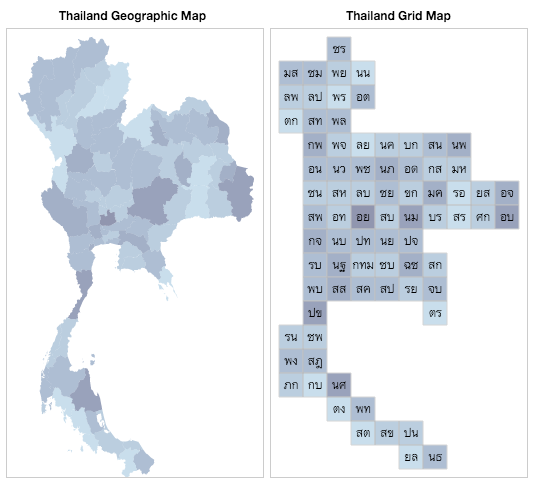

# gridmap-layout-thailand

Positions of tiles for Thailand grid map visualization. See [demo](http://kristw.github.io/gridmap-layout-thailand/)

<p align="center">
  
</p>

### Install

```
npm install gridmap-layout-thailand --save
```

or

```
bower install gridmap-layout-thailand --save
```

The data files can be found in the ```dist``` directory of the installed package. Either one of these files below can be used:

- dist/gridmap-layout-thailand.json
- dist/gridmap-layout-thailand.csv
- dist/gridmap-layout-thailand.js
- dist/gridmap-layout-thailand.min.js

The data in each file is an array of tiles (provinces). Each tile is in this format:

```javascript
[
  {
    "x": 2, // column index
    "y": 0, // row index
    "enName": "ChiangRai",
    "enAbbr": "CRI",
    "thName": "เชียงราย",
    "thAbbr": "ชร"
  },
  ...
]
```

### Example Usage

One way to use this is to use with [D3.js](http://d3js.org/). See a live example on [bl.ocks.org](http://bl.ocks.org/kristw/09ead46529638309cd60). Or you can use the ready-to-use component [d3Kit-gridmap](https://github.com/kristw/d3kit-gridmap).

```javascript
d3.json('path/to/gridmap-layout-thailand/dist/gridmap-layout-thailand.json', function(error, gridmapLayoutThailand){
  var options = {
    rectWidth: 25,
    rectHeight: 25
  };

  // Define color scale
  var color = d3.scale.quantize()
    .domain([1, 20])
    .range(['#b2ddf0', '#92bcd8', '#769cbf', '#5d7da7', '#46608f', '#334577', '#232d5f']);

  var svg = d3.select('svg')
    .attr('width', 250)
    .attr('height', 450);

  var sEnter = svg.append('g')
    .selectAll('g')
      .data(gridmapLayoutThailand)
    .enter().append('g')
      .attr('transform', function(d){return 'translate('+(d.x*options.rectWidth)+','+(d.y*options.rectHeight)+')';});

  sEnter.append('rect')
    .attr('width', options.rectWidth)
    .attr('height', options.rectHeight)
    .attr('vector-effect', 'non-scaling-stroke')
    .style('opacity', 0.5)
    .style('stroke', '#aaa')
    .style('fill', function(d){return color(d.enName.length);});

  sEnter.append('text')
    .attr('x', options.rectWidth/2)
    .attr('y', options.rectHeight/2 + 2)
    .style('text-anchor', 'middle')
    .text(function(d){return d.thAbbr;});
});
```

### Development

Read about the process from this [blog post](https://medium.com/@kristw/creating-grid-map-for-thailand-397b53a4ecf).

First, generate an output from the *force-directed + snap-to-grid* approach. The output is available at ```src/output/step3.csv``` and can be opened in Excel or Google Sheets to curate manually.

```
npm run precurate
```

After editing ```src/output/step3.csv``` and save as ```src/output/step3_curated.csv```, run this command to produce the final output and copy files to `examples` and `dist` directories.

```
npm run postcurate
```

Copyright (c) 2016 Krist Wongsuphasawat. Licensed under the MIT License
